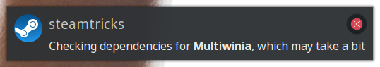
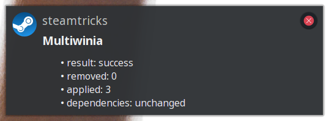

Steamtricks runs alongside Steam to automatically fix known issues with various
games on Linux. For example the following will occurred after Multiwinia is
installed.



If missing dependencies were found the user will be prompted to install them.
Any available fixes will be applied any-time the game is updated.



# game specific fixes

For a list of game specific fixes currently available see the
[steamtricks-data repository](https://github.com/steamtricks/steamtricks-data/tree/master/data).
There are also general fixes applied to the Steam Runtime and applicable games.

# installation

Currently, the only official packages available are for
[openSUSE](http://opensuse.org/) in the main repository and should be installed
by default with the `steam` package. Otherwise, the package name is
`steamtricks` and can be installed via the various GUIs or command line.

```
zypper in steamtricks
```

Once installed just restart Steam to enabled Steamtricks.

# monitor

The output from Steamtricks can be viewed using the following.

```
journalctl -f --user-unit steamtricksd
```

# manual setup

To try out without the package download the source and run the following from
the source directory while Steam is running.

```
./src/steamtricks --watch
```

# more details

Visit the [Steamtricks wiki](https://github.com/steamtricks/steamtricks/wiki)
for more details including how to try out nightly builds.
