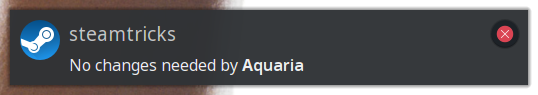

Steamtricks runs alongside Steam to automatically fix known issues with various
games on Linux.

- Check dependencies and prompt to install missing
- Apply fixes anytime a game is updated
- Display status notifications
- Suspend checks while games are running

The following will occur after Multiwinia is installed.


If missing dependencies were found the user will be prompted to install them.
For example when the "Dota 2 - Vulkan support" DLC is installed Steamtricks will
automatically prompt the user to install the required Vulkan packages.


Fixes will also be applied after games are updated since local file changes are
reverted as part of the update process.

Alternatively, for games that work just fine or those for which fixes are not
available Steamtricks will let you know it checked.



# game fixes

For a list of game specific fixes currently available see the
[steamtricks-data repository](https://github.com/steamtricks/steamtricks-data/tree/master/data).
There are also general fixes applied to the Steam Runtime and applicable games.

# installation

Currently, the only official packages available are for
[openSUSE](http://opensuse.org/) in the main repository and should be installed
by default with the `steam` package. Otherwise, the package name is
`steamtricks` and can be installed via the various GUIs or command line.

```
zypper in steamtricks
```

Once installed just restart Steam to enabled Steamtricks.

# monitor

The output from Steamtricks can be viewed using:

```
journalctl -f --user-unit steamtricksd
```

# manual setup

To use directly from source run the following from the source directory
while Steam is running.

```
./src/steamtricks --watch
```

# more details

Visit the [Steamtricks wiki](https://github.com/steamtricks/steamtricks/wiki)
for more details including how to install the nightly builds package.
